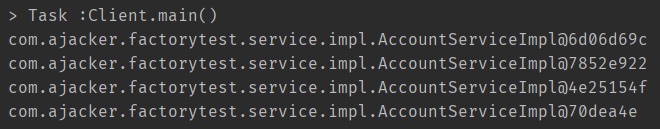
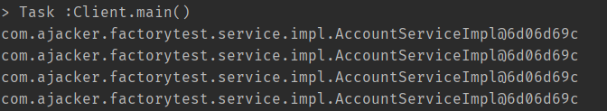

## 程序的耦合和解耦

- **耦合**: 程序间的依赖关系.在开发中,应该做到解决**编译期依赖**,即**编译期不依赖,运行时才依赖**.
- **解耦的思路**: 使用**反射来创建对**象,而**避免使用new关键字**,并**通过读取配置文件来获取要创建的对象全限定类名.**

### 解耦例子：JDBC驱动

在注册驱动的时候不使用`DriverManager`的`register`方法，而采用`Class.forName("驱动类全类名")`的方式

```java
public static void main(String[] args) {
        //注册驱动的方式1：创建驱动类的实例
        //DriverManager.registerDriver(new com.mysql.jdbc.Driver());
        //注册驱动的方式2：通过反射
        try {
            // 实际开发中此类名从properties文件中读取
            Class.forName("com.mysql.jdbc.Driver");
        } catch (ClassNotFoundException e) {
            // 产生的是运行时错误，不在编译期出错
            System.err.println("无法找到jdbc驱动！");
        }
    }
```

- 在第一种方式中，如果没有导入相应的依赖，就会无法通过编译，这就是我们说的**编译期依赖**


- 在第二种方式中，没有导入相应的包**可以通过编译**，只是会在**运行期间**产生异常


这就完成了**从编译期依赖转到运行期依赖**的过程，也就是实现了一定程度的**解耦合**

### 解耦例子：工厂模式 三层架构

- 首先我们模拟三层架构的实现

  - 业务层

    ```java
    /**
     * @author ajacker
     * 账户业务层接口
     */
    public interface IAccountService {
        /**
         * 模拟保存账户
         */
        void saveAccount();
    }
    ```

    

    ```java
    /**
     * @author ajacker
     * 账户的业务层实现类
     */
    public class AccountServiceImpl implements IAccountService {
        private IAccountDao accountDao = new AccountDaoImpl();
        @Override
        public void saveAccount() {
            accountDao.saveAccount();
        }
    }
    ```

  - 持久层

    ```java
    /**
     * @author ajacker
     * 账户的持久层接口
     */
    public interface IAccountDao {
        /**
         * 模拟保存账户
         */
        void saveAccount();
    }
    ```

    ```java
    /**
     * @author ajacker
     * 账户的持久层实现类
     */
    public class AccountDaoImpl implements IAccountDao {
        @Override
        public void saveAccount() {
            System.out.println("保存了账户");
        }
    }
    ```

- 表现层：

  ```java
  /**
   * @author ajacker
   * 模拟一个表现层
   */
  public class Client {
      public static void main(String[] args) {
          IAccountService as = new AccountServiceImpl();
          as.saveAccount();
      }
  }
  ```

  

  还记得上个例子中说的**解耦合**问题吗，很明显当前程序的耦合度是较高的，如果我们缺失了某个类，例如`AccountDaoImpl`，编译就无法通过

  ​	

- 我们可以使用工厂设计模式来缓解这个问题：

  ```java
  /**
   * @author ajacker
   * javabean的工厂
   */
  public class BeanFactory {
      /**
       * 定义一个Properties对象
       */
      private static Properties props;
      //使用静态代码块为Properties对象赋值
      static {
          try {
              //实例化对象
              props = new Properties();
              //获取Properties流对象
              InputStream in = BeanFactory.class.getClassLoader().getResourceAsStream("bean.properties");
              props.load(in);
          } catch (IOException e) {
              throw new ExceptionInInitializerError("初始化Properties失败");
          }
      }
  
      /**
       * 根据bean的名称返回对象
       * @param beanName bean名
       * @return 对应类型的对象
       */
      public static Object getBean(String beanName){
          Object bean = null;
          String beanPath = props.getProperty(beanName);
          try {
              //反射创建对象
              bean = Class.forName(beanPath).newInstance();
          } catch (Exception e) {
              e.printStackTrace();
          }
          return bean;
      }
  }
  ```

  我们通过读取`bean.properties`文件中的全限定类名，**使用反射来创建对象**，于此同时，我们表现层和业务层的代码做相应修改：

  ```java
  //使用工厂创建业务层对象
  IAccountService as = (IAccountService) BeanFactory.getBean("accountService");
  //使用工厂创建持久层对象
  private IAccountDao accountDao = (IAccountDao) BeanFactory.getBean("accountDao");
  ```

此时我们的程序在编译期间已经不硬性依赖于`AccountDaoImpl`和`AccountServiceImpl`类了，而是**在运行期间通过读取配置文件中的全限定类名来反射创建**我们所需要的对象。

### 工厂设计模式存在的问题和改造

我们循环创建四个对象并打印



可以清楚的看见创建的是不同的对象，也就是说之前我们的模式是**多例**的，每次获得的对象都是新创建的

现在我们对之前的设计进行一些改进

- 在`BeanFactory`类中添加一个`Map`，来保存`key`和具体对象的映射关系
- 在静态代码块中添加相应的代码来初始化这个`Map`

- 将获取对象的`getBean()`方法改为从`Map`中获得

全部改造完成以后大概是这个样子：

```java
/**
 * @author ajacker
 * javabean的工厂
 */
public class BeanFactory {
    /**
     * 定义一个Properties对象
     */
    private static Properties props;

    /**
     * 定义一个Map用来保存创建的对象
     */
    private static Map<String,Object> beans;
    //使用静态代码块为Properties对象赋值
    static {
        try {
            //实例化对象
            props = new Properties();
            //获取Properties流对象
            InputStream in = BeanFactory.class.getClassLoader().getResourceAsStream("bean.properties");
            props.load(in);
            //实例化容器
            beans = new HashMap<>();
            //取出配置文件中所有的keys
            Enumeration keys = props.keys();
            //遍历枚举
            while (keys.hasMoreElements()){
                //取出每个key
                String key = keys.nextElement().toString();
                //获取对应的value
                String beanPath = props.getProperty(key);
                //反射创建对象
                Object value = Class.forName(beanPath).newInstance();
                //把key和value存入容器
                beans.put(key,value);
            }
        } catch (Exception e) {
            throw new ExceptionInInitializerError("初始化Properties失败");
        }
    }

    /**
     * 根据bean的名称返回对象
     * @param beanName bean名
     * @return 对应类型的对象
     */
    public static Object getBean(String beanName){
        return beans.get(beanName);
//        Object bean = null;
//        String beanPath = props.getProperty(beanName);
//        try {
//            //反射创建对象
//            bean = Class.forName(beanPath).newInstance();
//        } catch (Exception e) {
//            e.printStackTrace();
//        }
//        return bean;
    }
}

```

这时候我们再尝试运行，发现已经成为了**单例**的了：




